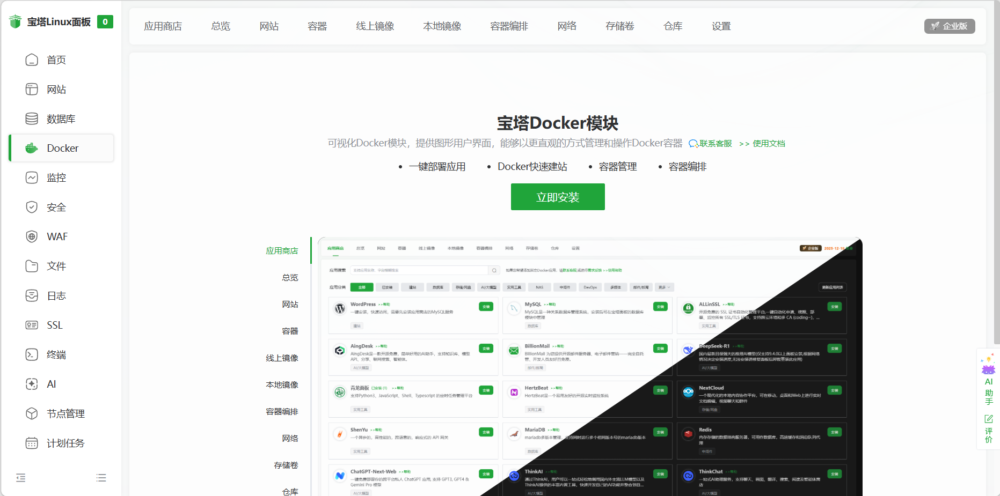
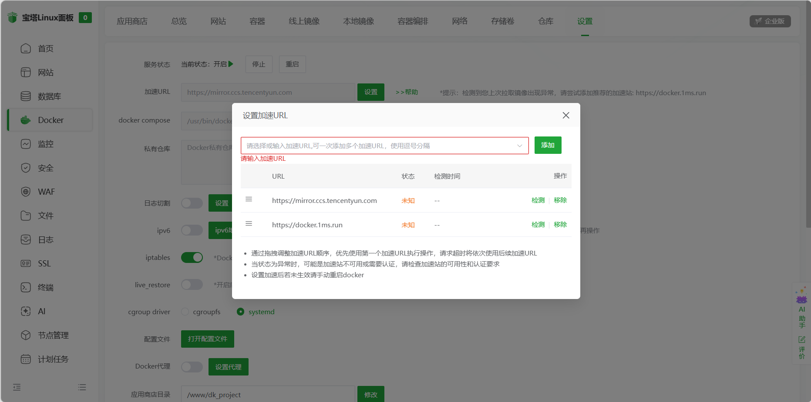
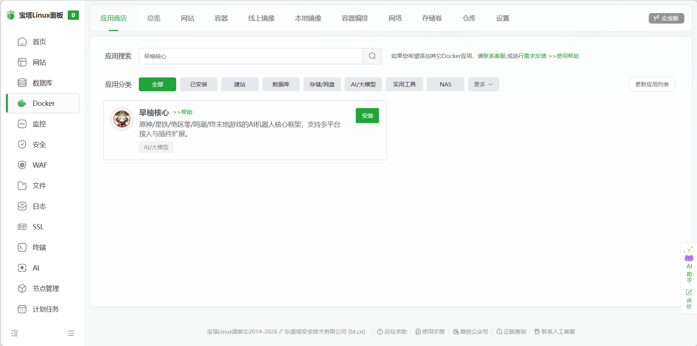
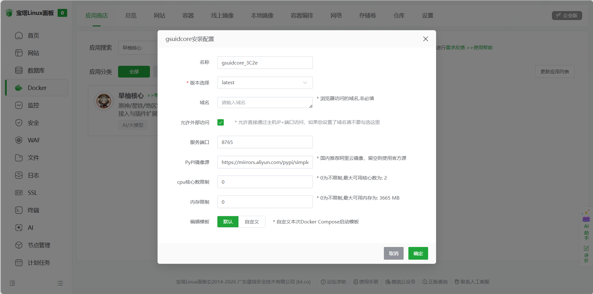
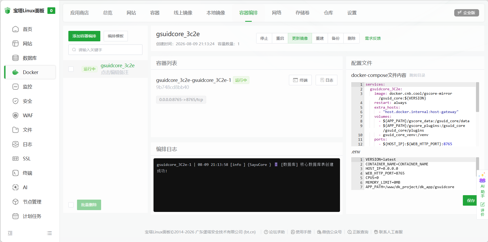

# 在宝塔面板部署GsCore<Badge type="danger" text="简单" />

[宝塔面板](https://www.bt.cn/new/index.html) 是一个安全高效、生产可用的 Linux/Windows 服务器运维面板。
GsCore 已上架至宝塔的 Docker 应用商店，支持**一键安装**。

## 1. 安装宝塔面板

如果您还没有安装宝塔面板，请参考 [快速安装宝塔面板](https://docs.bt.cn/getting-started/quick-installation-of-bt-panel) 进行安装。

## 2. 安装 Docker

进入宝塔面板首页，点击左侧菜单的 `Docker`，若未安装 Docker，宝塔会提示并引导你一键安装 Docker 及 Docker Compose，按提示完成安装即可。

## 3. 设置加速 URL（国内服务器用户）

进入宝塔面板页面后，点击左侧的 `Docker` → 点击顶部的 `设置`，在 `基础设置` 中找到 `加速 URL`，填入国内可用的镜像加速地址（例如 Docker 官方、阿里云容器镜像服务的个人加速地址），保存即可加速镜像拉取。

## 4. 安装 GsCore

进入 `Docker` 的 `应用商店`，在搜索框中搜索 `早柚核心`。

点击 `安装`，按照安装页面提示填写配置（默认端口为 `8765`），点击 `安装`，等待安装成功。

::: tip

如果在应用商店中搜索不到早柚核心，请点击应用商店右上角的 `更新应用列表`，等待应用列表刷新完成后，再进行搜索。

:::

## 5. 访问 GsCore

访问 `http://IP:8765/app` 即可进入 GsCore 的网页控制台。

- 首次进入需要注册，注册码在 `gsuid_core/data/config.json` 的 `REGISTER_CODE` 字段中
- 更多控制台说明见 [网页控制台](./WebConsole)

## 6. 后续操作

- GsCore 只是"核心"，还需要接入 Bot 才能收发消息，请参考 [适配Bot列表](../LinkBots/AdapterList)
- 部署完成后在网页控制台中即可安装/管理插件，参考 [安装插件](../InstallPlugins/InstallPlugins)

::: tip

数据持久化：容器内的玩家账号、数据库等核心资产存放在宿主机数据目录中，容器重建后数据不会丢失。

更新镜像：进入 `Docker` → `容器编排`，找到早柚核心的编排，点击 `更新镜像` 即可更新到最新版本。

:::
