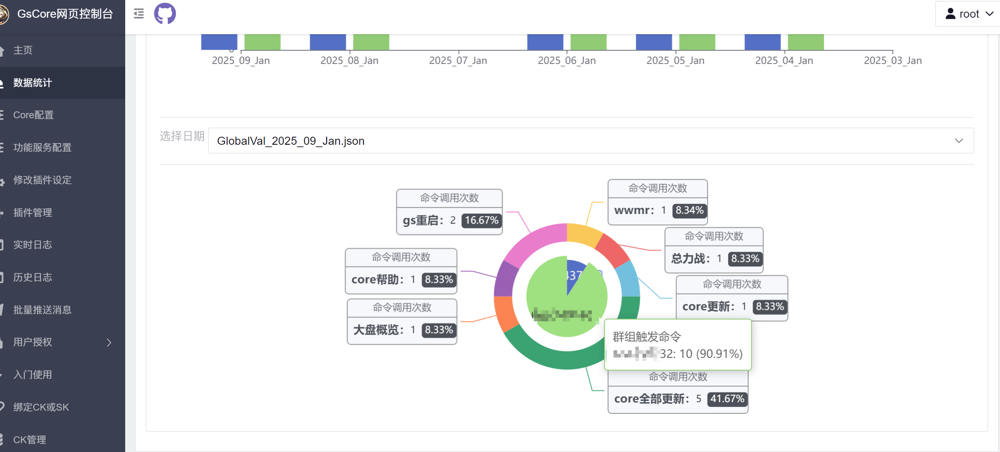
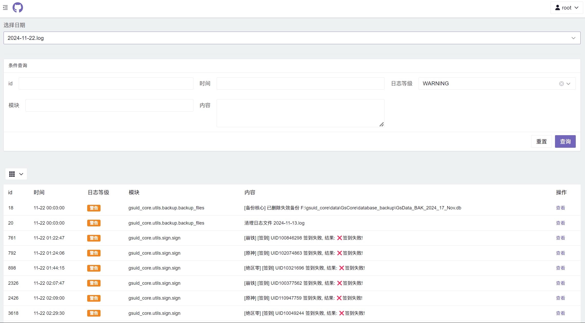

# 网页控制台<Badge type="tip" text="普通" />

- `网页控制台`无需开关，`gsuid_core`启动时将会自动启动

- 地址为`IP:PORT/genshinuid`,初始账号密码为`root`/`root`,进入之后请**务必**修改密码
- 默认的IP为`localhost`，PORT为`8765`，即**默认地址**为`localhost:8765/genshinuid`
  - 如需挂到公网上请改IP为`0.0.0.0`，并放行服务器端口
  - 修改IP的配置文件为`gsuid_core/data/config.json`(详见[文件结构](../Advance/DataStruct))

- `网页控制台`中`修改设定`一栏，`确认修改`后需要重启（可用命令`core重启`）

### 登陆界面

### 数据统计

### 单个插件功能配置 (可热更新，无需重启)

### 单个插件的配置 (能不能热更新，需要看代码)

### GsCore配置 (不可热更新，修改后请`core重启`)

### 数据表管理 (热更新)

### 插件管理

支持更新/安装，不支持卸载

### 历史日志

过滤历史日志（可选当天），支持按等级过滤，支持查找对应字符

